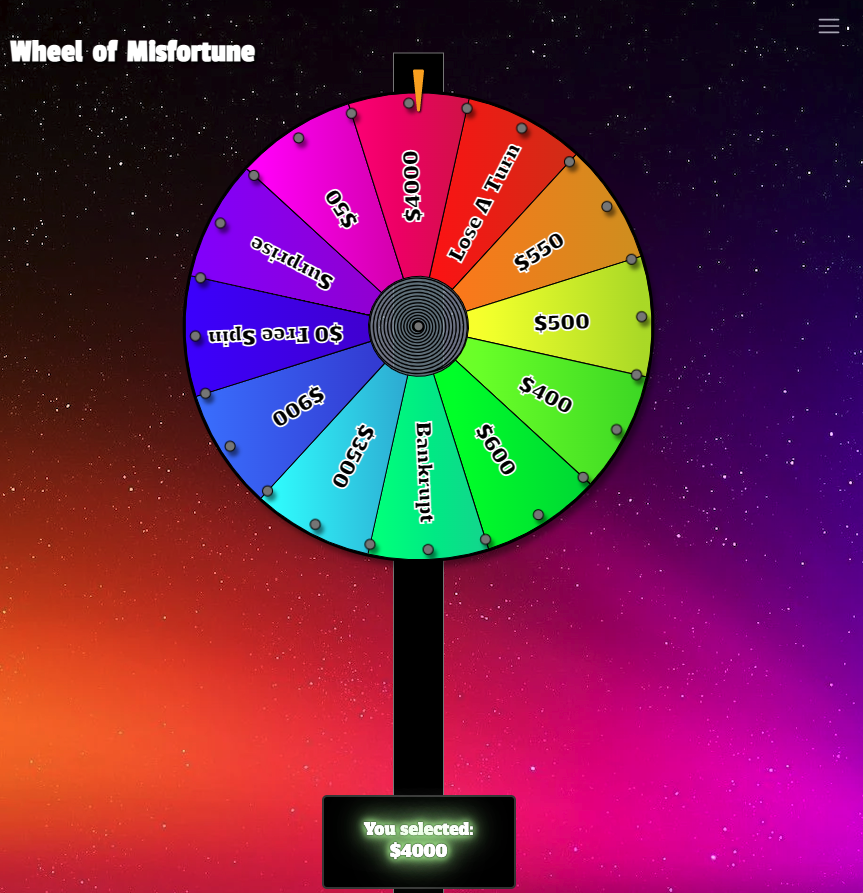

# Wheel of Misfortune

A physics based spinning carinval wheel built using JSX without React.

https://morgantheplant.github.io/wheel/

## Dependencies

- [Matter.js](https://brm.io/matter-js/) 2D physics engine for realistic feeling motion
- [Rollup](https://rollupjs.org/) for bundling
- [Custom JSX factory](./packages/render/createElement.ts)

## Why?

A while back I made an SVG wheel for a board game the relied on [Math.random()](https://developer.mozilla.org/en-US/docs/Web/JavaScript/Reference/Global_Objects/Math/random). It did not feel very natural or give the same satisfaction as spinning an actual carnival wheel, so I decided to rebuild the project from scratch using physics based animations. I was able to get a spinning wheel pretty quickly with Matter.js, but reached some limitations with customizing the wheel styling using the default Matter renderer. Decided instead to use a custom JSX factory function to render the animations so I could get the same tidy, composable API as React without all the extra overhead of mounting components and then reaching out to all the DOM nodes through the library. Possibly overkill here, but it sure was a lot of fun to build!

## JSX without React

The [custom JSX renderer](./packages/render/createElement.ts) is very simple and does not re-render when the props change. Instead render is only called to mount the app and a `connect` prop is used to update the DOM nodes directly. All app state is global (see [`./src/store/wheelSlice/`](./src/store/wheelSlice/) and [`/store`](./packages/store) inspired by redux). The `selector` prop is used to access a chunk of that state which is then passed to the `connect` prop. The `connect` prop returns a dict with DOM node attributes to update (similar to react-redux's `mapStateToProps`, but for DOM attributes). Physics was split from rendering with the thought that later on I could experiment with running physics on the server and then render animations in the browser so multiple users could see the same wheel spinning.

Note: This project was orignially written in boring old JS, but I ended up converting it to Typescript so this project would get a little more interest (all the cool kids use Typescript). I ended up just extending React's API so I wouldn't have to bother typing all the components directly.
